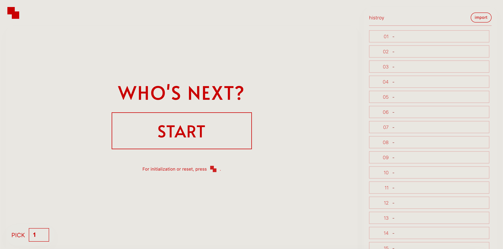

# WHO’S NEXT?



**WHO’S NEXT?** は、名前リストを入力するだけで
**順番をランダムに・公平に決められる Web アプリ** です。

会議、発表、ゲーム、飲み会、イベントなど、
「次は誰？」を決めたい場面で使えます。

サーバ不要・ブラウザだけで動作します。

---

## 主な特徴

* **完全ランダム**（一度出た人は出ません）
* 名前リストを **その場で入力・変更** 可能
* 抽選状況は **自動保存**（リロードしても続きから）
* **PC / スマートフォン対応**

---

## 使い方

### 1. 起動

`index.html` をブラウザで開いてください。
（ローカルファイルでOKです）

---

### 2. 名前リストを入力（IMPORT）

1. 画面右側（スマホでは下側）の **IMPORT** ボタンを押す
2. 入力パネルに名前を **1行につき1人** 入力する

例：

```
Alice
Bob
Charlie
David
```

3. **OK** を押すと、入力した名前で抽選が始められます

※ 名前が1つも入力されていない状態では、抽選できません。

---

### 3. PICK（人数）を設定

画面左下の **PICK** に、1回で選びたい人数を入力します。

* `1` → 1人ずつ
* `3` → 3人まとめて
* 途中で変更してもOK

---

### 4. 抽選する

中央の **START** ボタンを押します。

* ランダムに選ばれた名前が表示されます
* 表示された時点で **抽選は確定** します

表示された名前をクリックすると、次の抽選に進みます。

---

### 5. 履歴（HISTORY）

* 出た順番がすべて記録されます
* 一度出た名前は、次から **選ばれません**
* HISTORY 部分のみスクロールできます

---

## リセットについて


画面左上のアイコンがリセットボタンです。
押すと以下の選択肢が表示されます。

### Initialize（初期化）

* 名前リストを含め、すべてを空に戻します
* 「最初から作り直したい」場合はこちら

### Reset（リセット）

* **名前リストはそのまま**
* 抽選結果だけをリセットします
* 同じメンバーで、もう一度やり直したい場合はこちら

---

## 途中で名前リストを変更した場合

* 抽選の途中で **IMPORT → OK** を行うと、

  * 抽選は自動的にリセットされ
  * 新しい名前リストで最初から始まります

---

## 対応ブラウザ

動作確認済み：

* Chrome
* Safari
* Brave

注意：

* Arcではローディングエラーが発生することがあります。
* Brave（特にスマホ版）では、ダイアログ類がブロックされる場合があります。

---

## ランダム性について

* 抽選は **Fisher–Yates シャッフル**を使用しています
* 残っている全員が **等しい確率**で選ばれます

---

## ライセンス

自由に使用・改変して構いません。
個人利用・教育・イベント等でご自由にお使いください。
